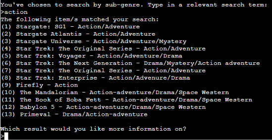

# My Sci-Fi TV Series Database

[This link takes you to my project.](https://sci-fi-series.herokuapp.com/)

This project is a database of information on popular Science Fiction TV shows that a user can explore.  
The information in this database is suitable for all ages and people; though it will, of course, be of most interest to Sci-Fi fans.  

  

## My Goals For This Project:

* To present information on a topic of interest
* To ensure navigation is simple and consistent throughout
* To ensure the program runs smoothly with no issues
* To offer a range of information that will satisfy the user
* To give the user an overall easy and pleasant experience

## How To Use It (UX)

As the program starts the user is presented with a welcome message explaining what the program is and what information is included.
Below that are simple instructions for how to navigate the program. The user simply has to enter relevant numbers or search terms and press enter. The user also has the option to see the menu at any time by typing "menu". The instructions also explain how to end the program.  
  
The menu is presented to the user so they can begin their search.  
The user responds to the program's requests so that the information they are looking for can be returned. After finding this information more can be found on the same topic, or a new search can be started. If the user chooses not to start a new search a goodbye message is printed and the program ends.

## Features

### Existing features

* Accepts user input
* Validates user input depending on the specific requirements of each input. For example, the menu requires the user to input a number from 1-5, the category choice requires the user to input a number from 1-9. If the input is not valid an appropriate error message is printed and the user is asked to try again
* Pulls data from the worksheet and compares the users input to the relevant data
* The user can bring up the menu or exit at any time

### Future features

* I would like to give the user the option to move backwards through their search, if for instance they have made a mistake in their choices
* I would like to give the user more categories to choose from and (in the right circumstances) give the program the ability to return results that are close even if not exact. For example, the option to search by decade; that looks at the first three digits of the release year and returns all items in that date range. I had written notes on how I might achieve this feature, however the idea for it came too late in project.

## Planning

To plan this project I created a flow chart to help visualise the process of the project. It was also very helpful for seeing what functions I would need and where to implement them. It doesn't include every feature of the program, but it was a very useful tool for getting started.  

## Testing

I have manually tested this project by:
* Passing the code through a PEP8 linter and confirming there are no problems
* Giving invalid inputs e.g. strings when only a number is required, numbers outside of the allowed range.
* Searching by all different categories until I had brought up every entry in the worksheet. 
* Testing in my local terminal and the Code Institute Heroku terminal

### Validator tesing
PEP8:
* Ran through pep8online.com with no issues

## Bugs

### Solved Bugs

* One of my validation functions failed to work and caused the program to exit as I had put the break statement in the wrong place.

* I had issues with my `search_columns` function. I had made the function too complicated, so it was harder to see the small issues inside it and it seemed that when I fixed one part of it another stopped working. Once I broke it into several different atomic functions the feature worked.

### Remaining Bugs
I had an issue in my `search_columns` function, in the block of `if keyword.lower() in item.lower():` If any cells had the same data the function would return only the first instance, repeated as many times as it occurs. For example:
if I were to search for 'action' in the sub-genre catergory it would return a result such as in the first image, instead of in the second:  
  
In my attempt to solve this bug:
* I used online resources like docs.gspread.org
* I examined the code in Python Tutor
* I perused several forums including Stack Overflow  
When I couldn't find a solution myself I used the work around of adding extra whitespace to each cell, where the data in it had more than one occurrence.  
If I were to revisit this project in the future I would want to find a solution to this bug. While this bug no longer effects the program I do not consider this bug solved, but rather avoided.

## Deployment

This project was deployed using Code Institue's mock terminal for Heroku.
The steps for deployment are as follows:
* Sign in to Heroku
* Create a new Heroku app, give it an appropriate name (sci-fi-series)
* In settings, add two config vars, one with Key and Value of PORT and 8000, respectively. The other with the Key CREDS and Value of the contents of my creds.json file
* Whilst in settings, set the buildbacks to Python and NodeJS in that order
* Connect the Heroku app to the GitHub repository
* Click Deploy

## Credits

* I used information from the Code Institute Love Sandwiches Walkthrough Project for connecting the worksheet to the workspace and for deployment
* I used Wikipedia and Rotten Tomatoes, alongside my own knowledge, for information in the database